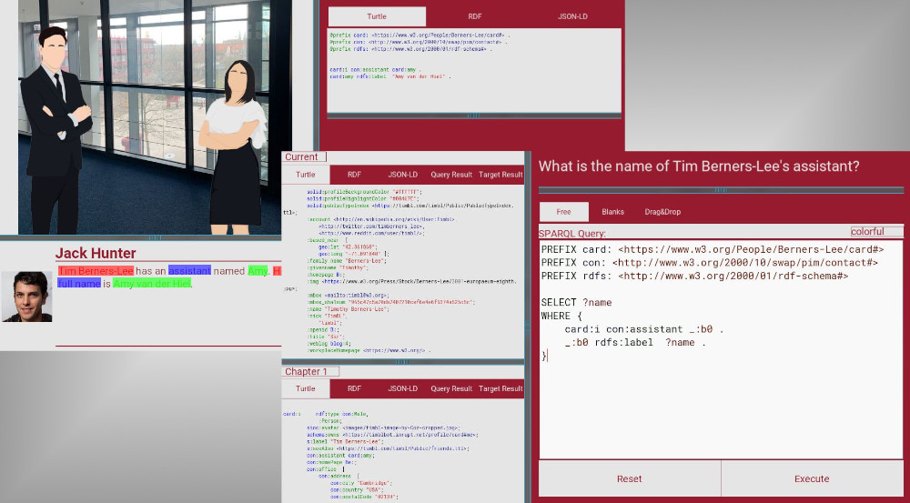

)

# RDeF - RDF Training and Demonstration Framework

## Description
RDeF is a Python framework for creating interactive stories based on RDF triples. In stories, players build their own knowledge base from RDF triples hidden in scenes and uncover new findings by querying this knowledge base with SPARQL requests. The objective of this framework is to provide students who are interested in Linked Data a prosumer platform to train their RDF and SPARQL skills. Stories are saved as RDF documents and can be easily exchanged with others.

### Objective
The objective of this framework is to give students an easy and enteraining tool to train their [RDF](https://www.w3.org/RDF/) and [SPARQL](https://www.w3.org/TR/sparql11-overview/) skills.

### Background
In contrast to SQL and relational databases, training material for Linked Data with the standards RDF and SPARQL is scarce. With RDeF this Scarcity can be encountered by enabling students to create training material on their own.

## GameJam
If you want to create your own interactive story, then join the the first RDeF-GameJam on [itch.io](https://itch.io/jams) in June. The creators of the five best stories receive a 20EUR amazon voucher. Updates will follow on this page.

## Installation
See [installation guide](installation.md)

## How to play a story
See the [howto play guide](playing.md)

## How to create a story
See [creator's guide](creating_stories.md)

## License
See [LICENSE](LICENSE) for details.