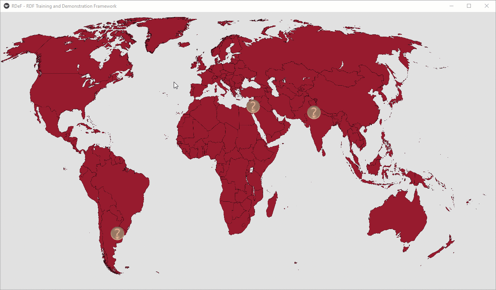
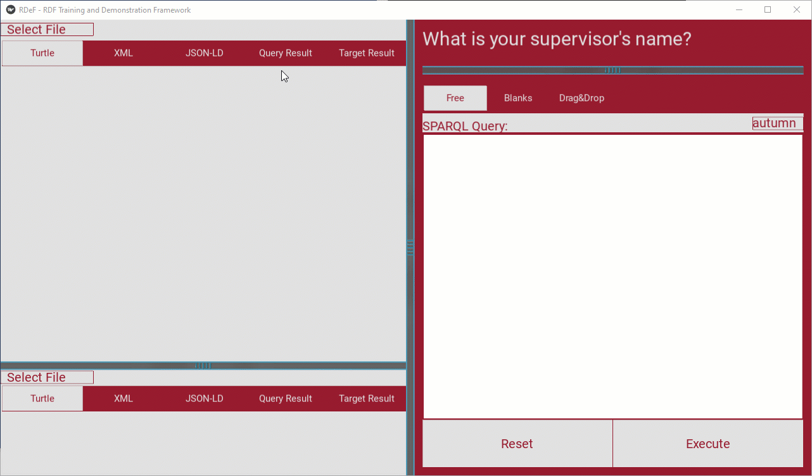

# How to Play a Story

## Controls
Before you start, note that you will need a working mouse and a keyboard to play a story. At the moment, no tab order is defined which is why you must rely on your mouse for navigation. 

## Selecting a Story
After running the main file, all available stories (see folder "stories") are listed in the terminal. Enter the associated number or the story's name. The story starts afterwards.
If there is only one story in the folder "stories", it starts automatically.

## Navigating Episodes
On the world map, you see several question mark widgets, click on one with the left mouse key to open the detail view. In the top of the detail view, the city where the episode is happening is given as hyperlink. The URL is shown when hovering on the label. In the middle of the detail view, you can see an image of an attendee, an episode title and a short description. To start an episode, click on the "Start"-Button at the bottom of the detail view.

## Discovering Triples
During a TalkScene, you see on the right a counter for triples to be found. If there is a zero, no triples are hidden in the displayed text and you can proceed with SPACE.
In case the number is not zero, you must first find the remaining triples before you can proceed. Click on a word in the displayed text. If it is a triple term, it will be highlighted (subject - red, predicate - blue, object - green).
You must find a subject, predicate and object that fit together to form a RDF triple. If you selected a term that is not in a triple with your current selection, highlighting will be removed from the unrelated terms.

Whenever you have identifed a matching triple, it will be added to your current knowledge base on the right. You can switch the displayed syntax between Turtle, RDF/XML and JSON-LD using the tabs. You cannot manually edit your knowledge base in TalkScene, it is just displayed for information.

## Solving Questions
In QueryScenes, a question is asked on the top-right that must be answered using a SPARQL request below. You have three options to write a SPARQL request - write free text, fill blanks or drag&drop boxes. The third option has all information provided and is therefore the easiest one. Whenever you are ready, you can execute the request by using the button below.

You can browse your knowledge base by using two file viewers on the left. The selection is done with a Dropdown-Button in the top-left corner.
For each file viewer you can choose between Turtle, RDF/XML and JSON-LD syntax. The query result displays the result of your SPARQL request or any errors. The target result shows the solution from the model solution.

